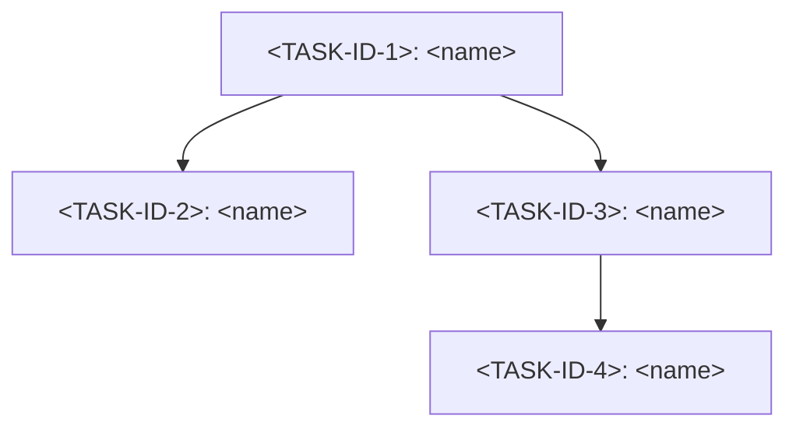

# Draft template reference — the MD draft `decompose` Phase 6 writes

This is the literal skeleton for `docs/decompose/YYYY-MM-DD-<epic>.md`, the
**self-contained primary artifact** the `decompose` skill produces. The user
reviews and edits this file directly; an optional tracker push only happens
afterward, on explicit approval, and only if a tracker is configured (see
`tracker-sync.md`). If no tracker is configured, this file is the deliverable,
full stop.

Unlike the other files in this `references/` directory, this layout is
**not** adapted from Open GSD — GSD has no equivalent single-file review
artifact (it spreads plan/phase/ROADMAP state across several files). This
format is native to `decompose`: one flat epic, one task table, one card per
task, one dependency graph, one traceability table, all in a single file a
human reads top to bottom in one pass.

Field names below are copied verbatim from `task-schema.md` — **6 author
fields** (`name`, `context`, `requirements`, `dod`, `story_points`,
`depends_on`), `truths` nested inside `dod`, and a computed `wave` that is
never hand-authored. If this file and `task-schema.md` ever disagree on a
name, `task-schema.md` wins and this file is wrong.

`<TASK-ID>` below is a generic placeholder — Phase 6 fills it with whatever
ID scheme the decomposition is using before any tracker exists (e.g. `T1`,
`T2`, ...). **Never** hardcode a tracker-specific ID shape (like `BA-NNN`)
into this template; `tracker-sync.md` is where a real tracker's ID format
enters the picture, and only after user approval.

## How to fill this in

1. Copy the fenced block below verbatim into
   `docs/decompose/YYYY-MM-DD-<epic>.md`.
2. Fill the epic header: title, one/two-sentence goal, the SP rollup (sum
   every task's `story_points`), and the wave count (count of distinct
   `wave` values across all tasks).
3. Add one row to the task table per task.
4. Add one card per task, in table order — every card carries all 6 author
   fields; `wave` does **not** appear on a card, only in the table and the
   graph, since it's computed, not authored.
5. Draw one mermaid node per task and one edge per `depends_on` entry.
6. Fill the traceability table with one row per `REQ-NN` from Phase 1 — a
   row with an empty `Tasks` cell is the same defect the QA subagent's
   Check 1 (requirement coverage) would flag as a BLOCKER.

The template uses four backticks for its outer fence specifically so the
inner ` ```mermaid ` fence survives untouched when you copy it out.

````markdown
# <Epic title — verb + object, not a bare noun phrase>

**Goal:** <one or two sentences: what this epic delivers and for whom>
**Story points (rollup):** <sum of every task's story_points below>
**Waves:** <count of distinct wave values across every task below>

## Tasks

| ID | Name | SP | depends_on | wave | REQ |
|---|---|---|---|---|---|
| `<TASK-ID-1>` | <verb + object> | <1\|2\|3\|5\|8\|13> | `[]` | 1 | [REQ-NN] |
| `<TASK-ID-2>` | <verb + object> | <1\|2\|3\|5\|8\|13> | [`<TASK-ID-1>`] | 2 | [REQ-NN] |
| `<TASK-ID-3>` | <verb + object> | <1\|2\|3\|5\|8\|13> | [`<TASK-ID-1>`] | 2 | [REQ-NN, REQ-NN] |
| `<TASK-ID-4>` | <verb + object> | <1\|2\|3\|5\|8\|13> | [`<TASK-ID-3>`] | 3 | [REQ-NN] |
<!-- one row per task; wave = max(wave of each depends_on entry) + 1,
     a task with depends_on: [] is always wave 1 -->

## Task cards

One card per row above, same order, all **6 author fields** present.
`wave` is intentionally absent here — it lives in the table and the graph,
not on the card, because it's computed in Phase 4, not authored.

### `<TASK-ID-1>`: <verb + object — matches the table row>

- **name:** <verb + object, identical to the table and the heading above>
- **context:** <why this task exists; `@`-references to the code, decisions,
  or conventions it must follow; related task IDs and what each provides or
  consumes from this one>
- **requirements:** [REQ-NN, ...] <!-- non-empty, always -->
- **dod:**
  - **done:** <observable state that means this task is finished>
  - **acceptance_criteria:**
    - <mechanically checkable condition — "file X contains string Y", not
      "works correctly">
    - <...>
  - **verify:** `<a real command, expected to run in under ~60s>`
  - **truths:**
    - "<goal-backward, user-observable fact this task now makes true>"
    - "<...>"
- **story_points:** <1|2|3|5|8|13> <!-- optional annotation, not a gate;
  > 8 is a WARNING to reconsider boundaries, never an automatic re-split -->
- **depends_on:** [`<TASK-ID>`, ...] <!-- `[]` if this is a wave-1 task -->

<!-- Repeat this card, same shape, once per remaining row in the Tasks
     table (`<TASK-ID-2>`, `<TASK-ID-3>`, `<TASK-ID-4>`, ...). -->

## Dependency graph



<!-- One node per task (T1/T2/... above are mermaid's own internal node
     keys, not the task's real ID — the real `<TASK-ID>` goes inside the
     label text). One edge per depends_on entry, drawn prerequisite ->
     dependent. A cycle here, or an edge to a node that isn't in the Tasks
     table, is exactly what qa-checklist.md Check 3 (graph acyclicity)
     exists to reject before this draft gets written. -->

## Traceability

| REQ | Tasks |
|---|---|
| REQ-01 | `<TASK-ID-1>` |
| REQ-02 | `<TASK-ID-2>`, `<TASK-ID-3>` |
| REQ-NN | `<TASK-ID-4>` |
<!-- one row per REQ-NN from Phase 1's requirements list; an empty Tasks
     cell is an uncovered requirement (qa-checklist.md Check 1, BLOCKER).
     Two tasks may legitimately share a REQ (Check 7 — MECE) as long as the
     split is deliberate and stated in each task's context. -->
````
